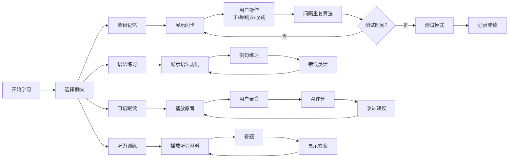

# 乌克兰语学习平台 - 产品需求文档 (PRD)

## 1. 产品概述

**UkrainianLearn** - 沉浸式乌克兰语在线学习平台，致力于为语言爱好者提供专业、有趣的乌克兰语学习体验。

- **核心目标**：让用户通过互动式、游戏化的方式掌握乌克兰语，从零基础到流利表达
- **目标用户**：对乌克兰语感兴趣的全球学习者，包括学生、职场人士、文化爱好者
- **市场价值**：乌克兰语学习资源相对稀缺，本平台填补了高质量互动学习工具的空白

---

## 2. 核心功能

### 2.1 用户角色

| 角色 | 注册方式 | 核心权限 |
|------|---------|---------|
| 访客 | 无 | 浏览首页、查看公开课程介绍 |
| 注册用户 | 邮箱/手机号注册 | 完整学习功能、进度追踪、社区互动 |
| 管理员 | 系统分配 | 内容管理、用户管理、数据分析 |

### 2.2 功能模块

1. **首页/落地页** - 品牌展示、课程介绍、注册引导
2. **用户认证系统** - 注册、登录、个人信息管理
3. **分级课程体系** - A1-C2级别课程内容
4. **互动学习模块** - 单词记忆、语法练习、口语跟读、听力训练
5. **学习进度追踪** - 仪表盘、成就系统、学习统计
6. **个性化推荐** - AI驱动的学习路径推荐
7. **社区系统** - 讨论区、学习伙伴、经验分享
8. **成就激励系统** - 徽章、排行榜、每日挑战

---

## 3. 核心页面详情

| 页面名称 | 模块名称 | 功能描述 |
|---------|---------|---------|
| 首页 | Hero区域 | 动态标语、乌克兰语字母艺术、CTA按钮 |
| 首页 | 课程展示 | A1-C2级别课程卡片，悬浮预览 |
| 首页 | 功能特色 | 四大互动模块介绍卡片 |
| 首页 | 社会证明 | 用户数量、学习时长、成功案例 |
| 注册/登录页 | 身份验证 | 邮箱注册、社交登录、表单验证 |
| 学习仪表盘 | 进度总览 | 今日学习时长、连续天数、总体进度 |
| 学习仪表盘 | 最近课程 | 继续学习、最近完成课程 |
| 学习仪表盘 | 成就展示 | 已获得徽章、进行中挑战 |
| 课程列表页 | 级别筛选 | A1-C2级别标签过滤 |
| 课程列表页 | 课程卡片 | 课程封面、难度标签、预计时长、进度条 |
| 课程详情页 | 课程信息 | 课程描述、学习目标、内容大纲 |
| 课程详情页 | 章节列表 | 章节树形结构、完成状态 |
| 单词记忆模块 | 闪卡学习 | 单词卡片翻转、双语对照、发音 |
| 单词记忆模块 | 记忆测试 | 选择题、拼写题、间隔重复算法 |
| 语法练习模块 | 语法讲解 | 例句、规则说明、交互式图解 |
| 语法练习模块 | 强化练习 | 填空、改错、排序等题型 |
| 口语跟读模块 | 跟读练习 | 音频播放、录音、对比波形 |
| 口语跟读模块 | 发音评分 | AI评分、改进建议 |
| 听力训练模块 | 听力材料库 | 日常对话、新闻、短文 |
| 听力训练模块 | 听力测试 | 填空、选择、听写题型 |
| 社区页面 | 讨论区 | 分类话题、帖子列表、评论 |
| 社区页面 | 学习伙伴 | 用户匹配、好友系统 |
| 个人中心 | 资料管理 | 头像、昵称、学习目标设置 |
| 个人中心 | 学习统计 | 详细数据图表、热力图 |
| 个人中心 | 设置 | 通知、隐私、语言偏好 |

---

## 4. 核心流程

### 4.1 用户注册与学习路径

```mermaid
flowchart TD
    A[访问首页] --> B{是否注册}
    B -->|否| C[注册页面]
    C --> D[填写信息/验证]
    D --> E[完成注册]
    E --> F[水平测试/选择目标]
    F --> G[生成个性化学习路径]
    B -->|是| H[登录]
    H --> G
    G --> I[进入学习仪表盘]
    I --> J[选择学习模块]
    J --> K[单词记忆|语法练习|口语跟读|听力训练]
    K --> L[完成学习活动]
    L --> M{获得成就?}
    M -->|是| N[解锁徽章]
    M -->|否| O[继续学习]
    N --> O
    O --> P[每日目标检查]
    P --> Q{完成?}
    Q -->|是| R[庆祝动画]
    Q -->|否| J
```

### 4.2 学习模块流程



---

## 5. 用户界面设计

### 5.1 设计风格

**概念方向**：融合乌克兰传统美学与现代极简主义的「文化科技」风格

**色彩系统**：
- 主色：乌克兰蓝 (#0057B8) - 代表天空与自由
- 辅助色：乌克兰黄 (#FFD700) - 代表麦田与希望
- 强调色：石榴红 (#E74C3C) - 用于成就、警示
- 背景色：云白 (#F8F9FA) / 深蓝夜空 (#1A1A2E) 暗色模式
- 文字色：深灰 (#2C3E50) / 浅灰 (#E8E8E8) 暗色模式

**字体选择**：
- 标题：Playfair Display (衬线字体，文化感)
- 正文：Source Sans Pro (无衬线，易读性)
- 乌克兰语：Noto Sans Ukrainian (支持乌克兰字母)

**按钮风格**：
- 圆角按钮 (border-radius: 12px)
- 悬停时轻微上浮 + 阴影加深
- 点击时缩放0.98效果

**布局风格**：
- 卡片式布局，间距16px
- 左侧导航栏 + 右侧内容区
- 响应式：桌面 > 平板 > 手机

**图标风格**：
- 使用 Lucide Icons (线性风格)
- 乌克兰元素装饰：蓝黄配色点缀

### 5.2 动效设计

- 页面切换：淡入淡出 + 轻微上移 (300ms ease-out)
- 卡片悬停：上浮8px + 阴影增强
- 成就解锁：弹跳动画 + 粒子效果
- 进度更新：数字滚动动画
- 口语波形：实时动态绘制

---

## 6. 技术架构

详细技术方案见 `.trae/documents/技术架构文档.md`
