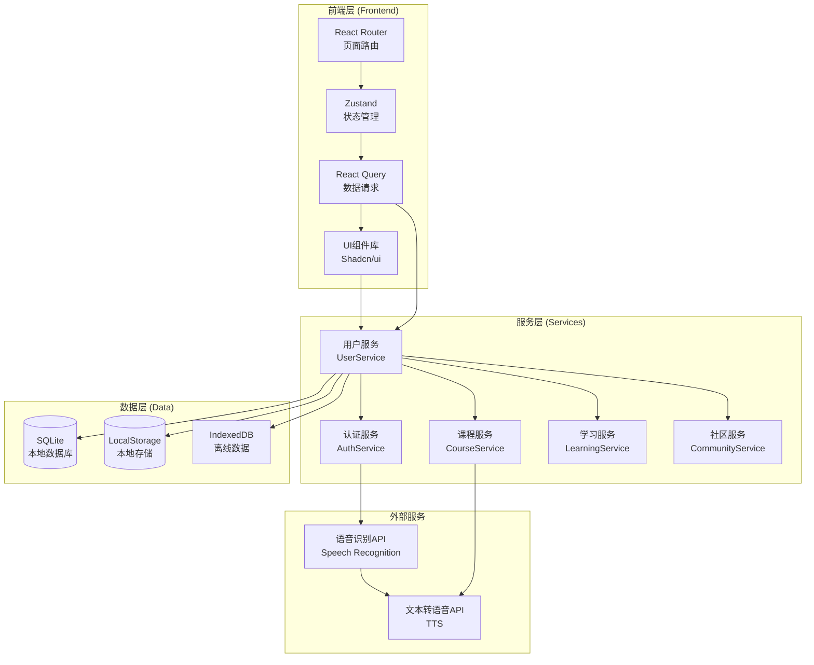
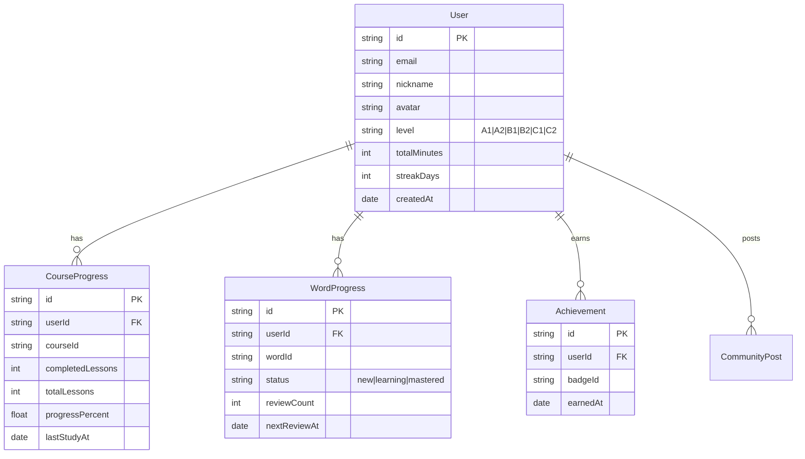
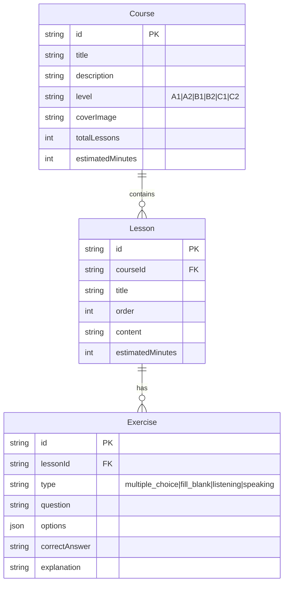

# 乌克兰语学习平台 - 技术架构文档

## 1. 架构设计



---

## 2. 技术选型

| 类别 | 技术栈 | 说明 |
|------|--------|------|
| 框架 | React@18 + TypeScript | 类型安全，组件化开发 |
| 构建 | Vite | 快速开发体验 |
| 样式 | Tailwind CSS + CSS变量 | 原子化样式 + 主题切换 |
| 路由 | React Router v6 | SPA路由管理 |
| 状态 | Zustand | 轻量级状态管理 |
| 请求 | React Query | 数据获取与缓存 |
| 动画 | Framer Motion | 交互动效 |
| 图表 | Recharts | 学习数据可视化 |
| 存储 | IndexedDB + LocalStorage | 本地数据持久化 |
| 语音 | Web Speech API | 口语评测 |
| 图表 | Chart.js | 进度统计 |

**注意**：本项目采用纯前端架构，所有数据存储在浏览器本地（IndexedDB + LocalStorage），无需后端服务器。

---

## 3. 路由定义

| 路由 | 页面名称 | 功能描述 |
|------|---------|---------|
| `/` | 首页 | 品牌展示、课程介绍、CTA |
| `/login` | 登录页 | 用户登录 |
| `/register` | 注册页 | 用户注册 |
| `/dashboard` | 学习仪表盘 | 进度总览、快速入口 |
| `/courses` | 课程列表 | 课程浏览与筛选 |
| `/courses/:id` | 课程详情 | 课程内容与章节 |
| `/learn/words` | 单词记忆 | 闪卡学习、测试 |
| `/learn/grammar` | 语法练习 | 语法讲解、练习题 |
| `/learn/speaking` | 口语跟读 | 录音、评分 |
| `/learn/listening` | 听力训练 | 听力材料、测试 |
| `/community` | 社区首页 | 讨论区入口 |
| `/community/:topicId` | 话题详情 | 帖子与评论 |
| `/profile` | 个人中心 | 资料管理 |
| `/profile/stats` | 学习统计 | 详细数据 |
| `/achievements` | 成就中心 | 徽章与排行 |

---

## 4. 数据模型

### 4.1 用户数据模型



### 4.2 课程数据模型



### 4.3 本地存储结构

```typescript
interface LocalStorageSchema {
  // 用户认证
  auth: {
    token: string;
    user: User;
  };
  // 用户偏好
  preferences: {
    theme: 'light' | 'dark' | 'auto';
    language: 'zh' | 'en' | 'uk';
    dailyGoal: number; // 分钟
  };
}

interface IndexedDBSchema {
  // 课程数据（缓存）
  courses: Course[];
  // 用户学习进度
  progress: {
    courseProgress: CourseProgress[];
    wordProgress: WordProgress[];
    grammarProgress: GrammarProgress[];
  };
  // 成就数据
  achievements: Achievement[];
  // 社区数据（缓存）
  community: {
    posts: Post[];
    comments: Comment[];
  };
}
```

---

## 5. 核心功能实现

### 5.1 单词记忆模块 (间隔重复算法)

```typescript
// SM-2 简化算法
interface ReviewResult {
  quality: 0 | 1 | 2 | 3 | 4 | 5; // 0-2: 忘记, 3-5: 记住
}

function calculateNextReview(word: WordProgress, result: ReviewResult): Date {
  if (result.quality < 3) {
    // 重新学习
    return new Date(Date.now() + 1 * 60 * 1000);
  }
  const interval = word.reviewCount === 0 ? 1 : 
                  word.reviewCount === 1 ? 6 : 
                  word.reviewCount * 2;
  return new Date(Date.now() + interval * 24 * 60 * 60 * 1000);
}
```

### 5.2 语音识别集成

```typescript
// 使用 Web Speech API
const speechRecognition = window.webkitSpeechRecognition || window.SpeechRecognition;

function startListening(lang: 'uk-UA'): Promise<string> {
  return new Promise((resolve, reject) => {
    const recognition = new speechRecognition();
    recognition.lang = lang;
    recognition.onresult = (event) => {
      resolve(event.results[0][0].transcript);
    };
    recognition.onerror = reject;
    recognition.start();
  });
}
```

### 5.3 学习进度计算

```typescript
function calculateOverallProgress(user: User): number {
  const courseWeight = 0.4;
  const wordWeight = 0.3;
  const grammarWeight = 0.2;
  const speakingWeight = 0.1;

  const courseProgress = getCompletedCourses() / TOTAL_COURSES;
  const wordProgress = getMasteredWords() / TOTAL_WORDS;
  const grammarProgress = getCompletedGrammar() / TOTAL_GRAMMAR;
  const speakingProgress = getSpeakingSessions() / TARGET_SESSIONS;

  return (courseProgress * courseWeight + 
          wordProgress * wordWeight + 
          grammarProgress * grammarWeight + 
          speakingProgress * speakingWeight) * 100;
}
```

---

## 6. 成就系统

| 徽章ID | 名称 | 条件 | 图标 |
|--------|------|------|------|
| first_lesson | 初学者 | 完成第一课 | 🎯 |
| week_streak | 一周坚持 | 连续7天学习 | 🔥 |
| month_streak | 月度之星 | 连续30天学习 | ⭐ |
| hundred_words | 词汇百个 | 掌握100个单词 | 📚 |
| thousand_words | 词汇千个 | 掌握1000个单词 | 🏆 |
| perfect_score | 满分达成 | 任何测试满分 | 💯 |
| speaking_master | 口语达人 | 完成50次跟读 | 🎤 |
| night_owl | 夜猫子学习 | 晚上11点后学习 | 🦉 |
| early_bird | 早起鸟儿 | 早上7点前学习 | 🐦 |

---

## 7. 初始数据

### 7.1 课程数据

```typescript
const initialCourses = [
  {
    id: 'a1-basics',
    title: 'A1 - 基础乌克兰语',
    description: '从零开始学习乌克兰语发音和日常用语',
    level: 'A1',
    lessons: [
      { id: 'a1-1', title: '乌克兰语字母表', order: 1 },
      { id: 'a1-2', title: '问候与介绍', order: 2 },
      { id: 'a1-3', title: '数字1-10', order: 3 },
      // ...
    ]
  },
  // A2, B1, B2, C1, C2 课程...
];
```

### 7.2 初始单词库

包含至少200个常用乌克兰语单词，带有：
- 乌克兰语拼写
- 中文释义
- 乌克兰语发音（文字描述）
- 例句
- 词性标注

---

## 8. 项目结构

```
ukrainian-learn/
├── public/
│   └── favicon.ico
├── src/
│   ├── components/
│   │   ├── ui/           # UI基础组件
│   │   ├── layout/       # 布局组件
│   │   ├── learning/     # 学习模块组件
│   │   └── community/    # 社区组件
│   ├── pages/            # 页面组件
│   ├── hooks/            # 自定义Hooks
│   ├── stores/           # Zustand状态
│   ├── services/         # 业务逻辑服务
│   ├── data/             # 静态数据
│   ├── utils/            # 工具函数
│   ├── types/            # TypeScript类型
│   ├── App.tsx
│   ├── main.tsx
│   └── index.css
├── index.html
├── package.json
├── tsconfig.json
├── vite.config.ts
├── tailwind.config.js
└── postcss.config.js
```
